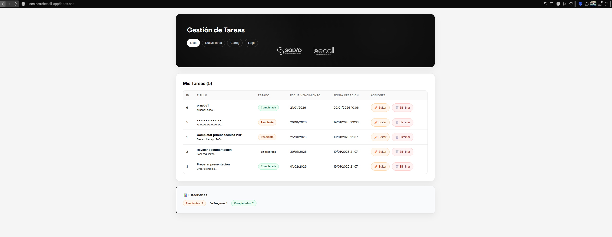
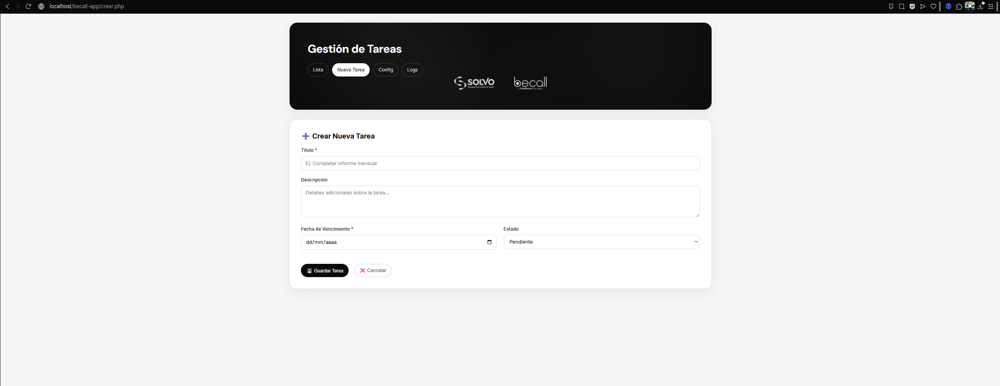
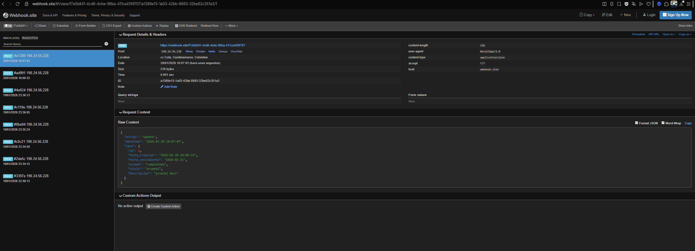
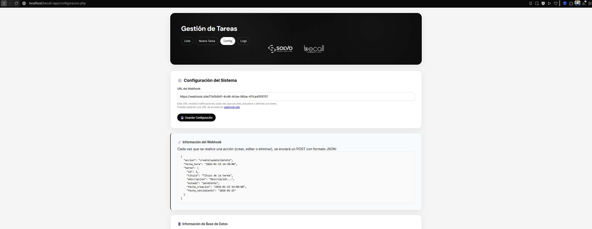
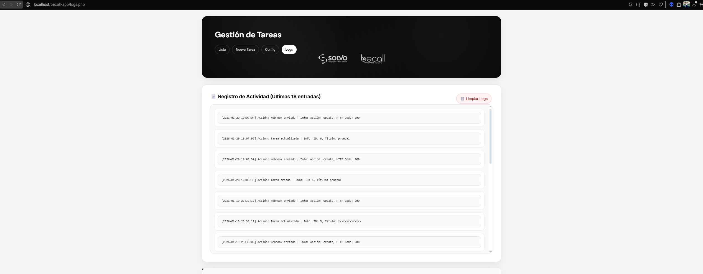

# 📋 Becall – Gestión de Tareas (PHP)

Aplicación web para la gestión de tareas desarrollada en **PHP puro**, con operaciones CRUD, API REST y notificaciones mediante **webhooks**. El proyecto está diseñado para ejecutarse **localmente**, con una estructura clara y fácil de entender.

---

## 🚀 Tecnologías utilizadas

- **PHP 7.4 o superior**
- **MySQL / MariaDB**
- **Apache (XAMPP recomendado)**
- **HTML + CSS** (frontend simple y funcional)
- **cURL** (envío de webhooks)

---

## 📌 Funcionalidades

- Crear, listar, editar y eliminar tareas
- Estados de tareas:
  - Pendiente
  - En progreso
  - Completada
- API REST para consultar tareas
- Registro de acciones en archivo de logs
- Envío de webhooks al crear, actualizar o eliminar tareas
- Interfaz web minimalista

---

## 📁 Estructura del proyecto

```
becall-app/
│
├── api/                # Endpoints de la API
├── config/             # Configuración (DB y app)
├── includes/           # Clases (Database, Tarea, Webhook, Logger)
├── logs/               # Logs de la aplicación
├── public/             # Frontend
│   └── assets/
│       └── logos/
├── database.sql        # Script de base de datos
├── .htaccess
└── README.md
```

---

## ⚙️ Requisitos

Antes de ejecutar el proyecto, asegúrate de contar con:

- PHP **7.4 o superior**
- MySQL o MariaDB
- Servidor Apache (XAMPP rec1️⃣ Instalar XAMPP1. aDescarga XAMPP desde:https://www.apachefriends.org
2. Instálalo con los módulos:

Apahe

My3. SQL

Abre XAMPP Control Panel y aranca:
✅ Apache
a XAMPP desde:omendado)

---

## 🛠️ Instalación y ejecución local

### 1️⃣ Clonar el repositorio

```bash
git clone https://github.com/erickdavidanaya1/becall-app.git
```

Ubica el proyecto dentro de:

```
C:\xampp\htdocs\becall-app
```

---

### 2️⃣ Importar la base de datos

1. Abre **phpMyAdmin**
2. Crea una base de datos llamada:

```
becall_app
```

3. Importa el archivo:

```
database.sql
```

---

### 3️⃣ Configurar la conexión a la base de datos

Edita el archivo:

```
config/database.php
```

Verifica que los datos sean correctos:

```php
define('DB_HOST', 'localhost');
define('DB_NAME', 'becall_app');
define('DB_USER', 'root');
define('DB_PASS', '');
```

---

### 4️⃣ Configurar Webhook (opcional)

La aplicación soporta webhooks para notificar las acciones `create`, `update` y `delete`.

1. Ingresa a https://webhook.site
2. Copia tu **Your Unique URL**
3. Inserta la URL en la tabla `config` o ejecutando la aplicación y desde http://localhost/becall-app/configuracion.php --> Configuración del Sistema --> URL del Webhook
y guardar configuración

```sql
INSERT INTO config (clave, valor)
VALUES ('webhook_url', 'https://webhook.site/TU-ID');
```

---

## 🚀 Ejecutar la aplicación

- **Interfaz web:**
```
http://localhost/becall-app/public/
```

- **API REST (GET):**
```
http://localhost/becall-app/api/tareas
```

---

## 🔗 API – Endpoint disponible

### Obtener listado de tareas

**GET**
```
/api/tareas
```

**Respuesta ejemplo:**

```json
{
  "data": [
    {
      "id": 1,
      "titulo": "Completar prueba técnica",
      "descripcion": "Desarrollar app ToDo",
      "estado": "pendiente",
      "fecha_vencimiento": "2026-01-25",
      "fecha_creacion": "2026-01-19 21:07:15"
    }
  ]
}
```

---

## 🧾 Logs

Las acciones importantes del sistema se registran en:

```
logs/app.log
```

Incluye:
- Creación de tareas
- Actualización
- Eliminación
- Errores del sistema
- Envío de webhooks

---

## 📝 Notas

- No se implementó autenticación, ya que no era requerida
- El frontend se mantuvo simple de forma intencional
- El enfoque principal es la lógica backend y la estructura del proyecto
- El proyecto es fácilmente extensible

---

## 👤 Autor

**Erick Anaya**  
Prueba técnica – PHP

## 🖼️ Screenshots





